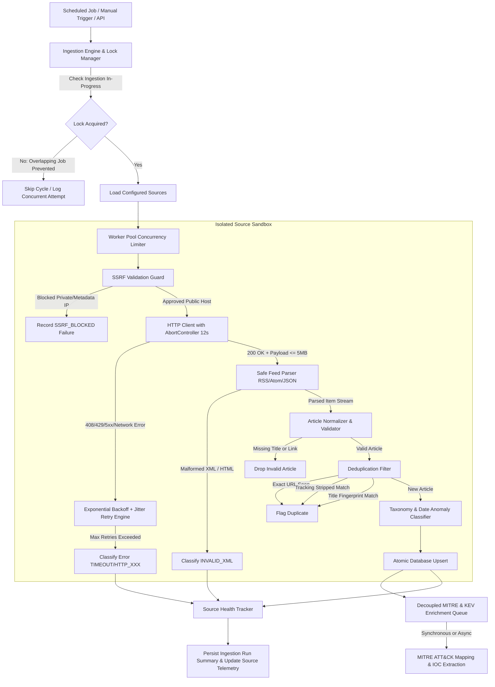

# SOC-AI Production Fetching & Ingestion Architecture

## 1. Architectural Overview & Design Principles

SOC-AI is a high-throughput, production-grade cybersecurity intelligence platform designed to ingest, normalize, deduplicate, classify, and enrich threat intelligence articles from 500+ heterogeneous external sources (RSS 2.0, Atom 1.0, and JSON/REST APIs).

The central ingestion engine is designed around five non-negotiable operational principles:
1. **Source Isolation**: A single dead, malformed, rate-limited, or slow external feed must *never* crash or abort an ingestion cycle. Every source executes in an isolated sandbox with independent lifecycle tracking.
2. **Decoupled Processing Stages**: External network fetching, feed parsing, URL/title deduplication, relational persistence, and MITRE ATT&CK / AI enrichment are strictly decoupled. If AI enrichment or MITRE mapping fails or is delayed, raw threat articles are persisted immediately and remain accessible to SOC analysts.
3. **Controlled Concurrency & Resource Safety**: Rather than launching unbounded parallel network connections (`Promise.all(500)`), ingestion is orchestrated via a configurable worker pool (`FETCH_CONCURRENCY=10`) with request timeouts (12s connection, 20s total), response size capping (5MB), and Server-Side Request Forgery (SSRF) defense.
4. **Deterministic Deduplication**: Ingestion employs a three-layer deduplication filter (exact canonical URL, normalized URL stripping 18+ marketing/tracking parameters, and normalized title fingerprint hashing) to prevent duplicate alerts and redundant AI cost.
5. **Truthful Telemetry**: The platform distinguishes between *configured sources*, *enabled sources*, *active fetch attempts*, *successful parses*, *empty feeds*, and *failed sources*. Health metrics, consecutive failure counts, and response latencies reflect empirical measurements rather than hardcoded states.

---

## 2. Ingestion Pipeline Architecture



---

## 3. Step-by-Step Processing Stages

### Stage 1: Feed Fetching (`feedFetcher.js` & `ssrfGuard.js`)
- **Protocol Enforcement**: Only `http:` and `https:` protocols are permitted.
- **SSRF Guard**: Pre-flight host inspection blocks `localhost`, `127.0.0.1`, `::1`, AWS/GCP cloud metadata IP `169.254.169.254`, and RFC 1918 private subnets (`10.0.0.0/8`, `172.16.0.0/12`, `192.168.0.0/16`).
- **Headers**: Identifiable User-Agent `SOC-AI-Bot/1.0 (+https://github.com/ceylonroameryt-bit/SOC-AI)` and content negotiation headers (`application/rss+xml, application/atom+xml, application/xml, text/xml, application/json`).
- **Timeout & Size Guards**: 12-second connection timeout via `AbortSignal.timeout(12000)` and 5MB streaming size cap via `content-length` check.

### Stage 2: Retry Engine (`retryEngine.js`)
- **Retryable Errors**: Transient network disconnects (`ECONNRESET`, `ETIMEDOUT`, `EAI_AGAIN`), server rate-limiting (HTTP 429), request timeouts (HTTP 408), and gateway/server errors (HTTP 500, 502, 503, 504).
- **Non-Retryable Errors**: Client errors (HTTP 400, 401, 403, 404) and parser/validation errors are rejected immediately without wasting network bandwidth.
- **Backoff & Jitter**: Full-jitter exponential backoff `delay = Math.min(maxDelay, baseDelay * (2 ^ attempt)) * (0.8 + Math.random() * 0.4)`. Honors `Retry-After` HTTP headers.

### Stage 3: Robust Feed Parsing (`feedParser.js`)
- Safely handles RSS 0.9x, RSS 2.0, Atom 1.0, and JSON Feed formats.
- **Atom Link Array Handling**: Atom specifications allow multiple `<link>` tags (enclosures, related links, self). `extractItemLink()` prioritizes `rel="alternate"` and resolves object schemas without invoking string methods on raw arrays.
- **Extended Content Extraction**: Extracts `content:encoded`, `content`, `description`, and `summary` while stripping dangerous embedded scripts.
- **Empty Feed Detection**: Distinguishes between successful HTTP 200 responses with 0 items (`EMPTY_FEED`) and fatal parser failures (`INVALID_XML`).

### Stage 4: URL Normalization & Deduplication (`urlNormalizer.js` & `deduplicator.js`)
- **Query Parameter Scrubbing**: Strips 18+ tracking and campaign parameters including `utm_source`, `utm_medium`, `utm_campaign`, `utm_term`, `utm_content`, `fbclid`, `gclid`, `msclkid`, `mc_eid`, and `ref`.
- **Structural Normalization**: Lowercases hostname, strips default ports (`:80`, `:443`), removes URL hash fragments, and collapses trailing slashes.
- **Title Fingerprint**: Generates a deterministic SHA-256 hash from lowercased, punctuation-stripped, whitespace-collapsed article titles to detect cross-syndicated articles published with different URLs.

### Stage 5: Article Validation & Date Anomaly Detection (`articlePipeline.js`)
- Mandatory verification: Article must contain a non-empty string title and a valid HTTP/HTTPS URL.
- Optional fields (author, summary, image, tags) are populated with safe defaults.
- **Date Anomaly Defense**: Dates parsed from RFC 822 (`pubDate`), ISO 8601 (`published`), or UNIX timestamps. Future-dated articles (>2 hours in advance) are tagged with `dateAnomaly: true` and clamped to current ingestion time to prevent archive sorting evasion.

### Stage 6: Database Persistence (`db.js`)
- **Conflict Handling**: Uses PostgreSQL `ON CONFLICT (link) DO UPDATE ... RETURNING id, (xmax = 0) AS is_inserted`.
- **Truthful Mutation State**: Distinguishes true insertions (`isNew: true`, `isInserted: true`) from deduplicated updates (`isDuplicate: true`), preventing inaccurate article counter inflation.
- **Batch IOC Optimization**: IOCs (`cve`, `domain`, `ip`, `md5`, `sha256`) extracted during ingestion are inserted via `insertIocsBatch()` using parameterized multi-row `VALUES ($1, $2, ...)` blocks, replacing 1,500 individual queries with a single atomic batch transaction.

### Stage 7: Decoupled MITRE & AI Enrichment (`mitreService.js`)
- Threat taxonomy classification and MITRE ATT&CK mapping (52 technique definitions) operate on validated in-memory article structures.
- Failures during LLM or MITRE enrichment log an alert but do not rollback or discard the persisted article.

---

## 4. Concurrency & Scheduling Configuration

| Environment Variable | Default Value | Description |
| :--- | :--- | :--- |
| `FETCH_CONCURRENCY` | `10` | Maximum number of external feeds fetched concurrently in the worker pool. |
| `FETCH_TIMEOUT_MS` | `12000` | Network request timeout in milliseconds for each external feed request. |
| `FETCH_TOTAL_TIMEOUT_MS` | `20000` | Maximum allowable duration for an entire source lifecycle (network + retry + parse). |
| `FETCH_MAX_RETRIES` | `2` | Maximum retry attempts for transient HTTP / network errors. |
| `MAX_ARTICLES_PER_SOURCE` | `50` | Maximum number of parsed items retained per feed cycle to prevent memory exhaustion. |
| `MAX_FEED_BODY_BYTES` | `5242880` | Maximum feed payload size in bytes (5 MB). |
| `CRON_SECRET` | `""` | Bearer token required for triggering scheduled ingestion runs via HTTP endpoints. |
| `FETCH_CRON_SCHEDULE` | `*/15 * * * *` | Node-cron schedule (defaults to every 15 minutes). |

---

## 5. Standardized Error Categories

Every failed feed fetch produces a typed `FetchResult` containing one of the following canonical error categories:

- `TIMEOUT`: Request exceeded `FETCH_TIMEOUT_MS` or server failed to respond.
- `DNS_ERROR`: Hostname resolution failed (`ENOTFOUND`, `EAI_AGAIN`).
- `NETWORK_ERROR`: Connection reset, broken socket, or protocol error (`ECONNRESET`, `ECONNREFUSED`).
- `SSRF_BLOCKED`: Feed URL resolved to a forbidden private, loopback, or cloud metadata IP address.
- `PAYLOAD_TOO_LARGE`: Response size exceeded `MAX_FEED_BODY_BYTES` (5 MB).
- `HTTP_401`: Feed requires basic or token authentication.
- `HTTP_403`: Feed access forbidden (Cloudflare block, anti-bot protection, or IP ban).
- `HTTP_404`: Feed endpoint not found or permanently removed.
- `HTTP_429`: Source rate limit exceeded.
- `HTTP_5XX`: Target server experienced an internal error (500, 502, 503, 504).
- `INVALID_XML`: Feed returned invalid XML, malformed Atom, or HTML error page.
- `INVALID_JSON`: Target REST API returned unparseable JSON.
- `EMPTY_FEED`: Source returned valid XML/JSON with 0 items.
- `DATABASE_ERROR`: Persistence layer failed during upsert.
- `VALIDATION_ERROR`: Article payload failed schema integrity checks.
- `UNKNOWN_ERROR`: Unhandled exception.

---

## 6. Comprehensive Job Summary Format

At the conclusion of each ingestion run, the engine logs and persists a structured telemetry summary:

```json
{
  "jobId": "run-1728079200000-a1b2",
  "startedAt": "2026-10-04T21:00:00.000Z",
  "completedAt": "2026-10-04T21:01:14.250Z",
  "durationMs": 74250,
  "sourcesConfigured": 512,
  "sourcesAttempted": 500,
  "sourcesSuccessful": 472,
  "sourcesFailed": 28,
  "articlesReceived": 1824,
  "articlesDuplicates": 1102,
  "articlesInserted": 722,
  "articlesUpdated": 14,
  "mitreProcessed": 722,
  "mitrePending": 0,
  "errorBreakdown": {
    "TIMEOUT": 8,
    "HTTP_403": 7,
    "HTTP_404": 4,
    "HTTP_5XX": 3,
    "INVALID_XML": 4,
    "SSRF_BLOCKED": 1,
    "OTHER": 1
  }
}
```
