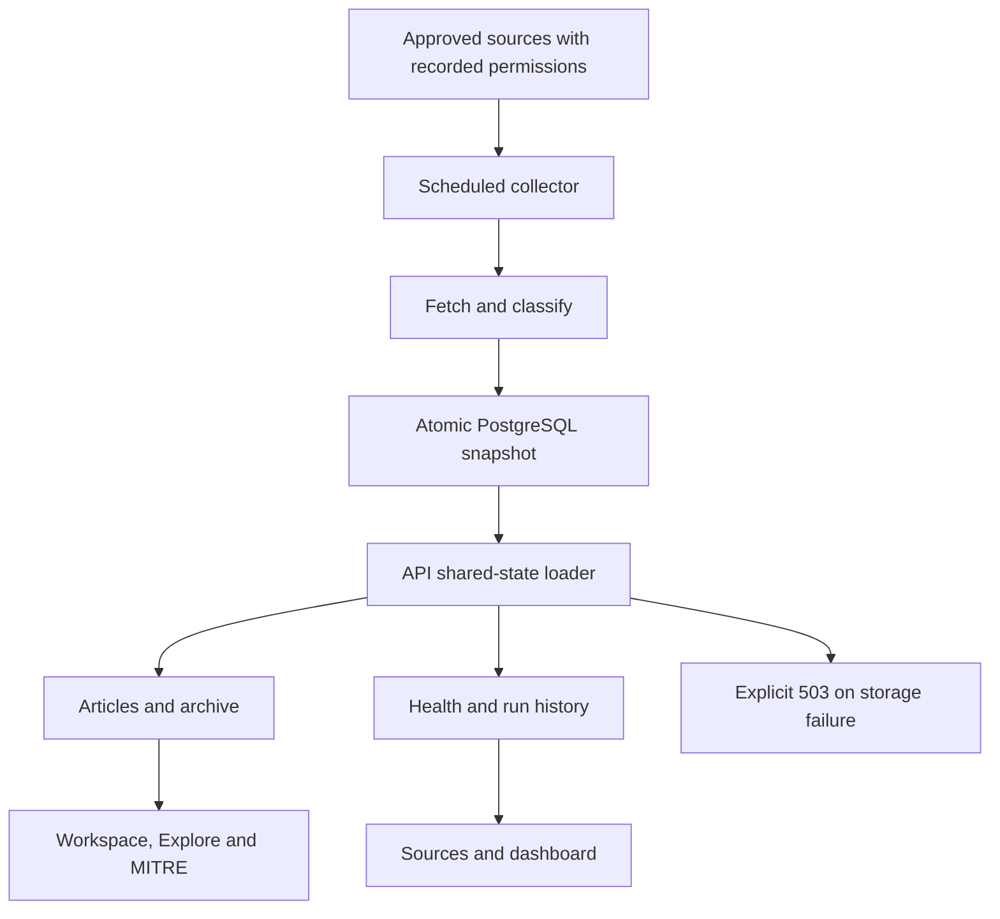

# SOC-AI: website map and shared data repair

Reviewed against main `b4b8106` on 1 October 2026. This file accompanies the code fix; it does not claim production has been redeployed.

## Confirmed production symptoms

Read-only requests on 1 October found:

- `GET /api/explore/coverage`: HTTP 200, only two records, newest publication 26 September 2026 at 14:00 UTC.
- `GET /api/sources/runs`: HTTP 404, `Source not found in registry`. The dynamic `/:id` route intercepted `/runs`.

The collector and Vercel API ran in different filesystems. Local collector output disappeared with the Actions runner, while Vercel read its bundled seed. Optional SQL inserts were not connected to the news reader. An additional memory-cache shortcut skipped the existing disk mtime check.

## Corrected collection path

`intelligence_snapshot` contains one current JSONB publication: full article records, health measurements, collection history and a publication timestamp. This preserves stable IDs, null publication dates, attribution and classification fields that the legacy threats table cannot represent faithfully. It is bounded to 10,000 articles, matching existing retention; it is not an unlimited historical archive.

The CLI reads the previous publication before collecting, so runner replacement does not discard archive history. It awaits the shared write before reporting success. Database/network errors cannot bootstrap a replacement archive; only a missing table or an empty store can bootstrap. The API waits for one coalesced refresh at most every 60 seconds per instance. An expired cache that cannot refresh produces HTTP 503, not an apparently current seed response. Empty published collections remain empty. Local development without shared storage still reads JSON and checks mtime on every access.

The deployment still uses one Express application via the two Vercel bridge files. No separate duplicate serverless route implementation is introduced.

## Page map

| URL | Component | Main data dependency |
|---|---|---|
| `/`, `/intelligence`, `/news`, `/global-news` | IntelligenceWorkspace | `/api/news`, `/api/dashboard/snapshot` |
| `/overview` | Dashboard and dashboard widgets | Snapshot, news/stats, news, MITRE heatmap, AI brief |
| `/vulnerabilities` | VulnerabilitiesView | News plus snapshot KEV data; external KEV availability is separate |
| `/investigate`, `/enrich` | Enrichment | `/api/enrich/ip/:ip`, `/hash/:hash`, `/cve/:cveId`, `/queries/:ioc`, POST `/iocs` |
| `/detections` | DetectionsHub | Navigation into rules and MITRE views |
| `/mitre` | MitreHeatmap | `/api/mitre/heatmap` |
| `/mitre-news`, `/mitre/news` | MitreNews | `/api/mitre/news` |
| `/rules` | RuleLibrary | `/api/rules/sigma`, `/api/rules/yara` |
| `/reports` | ReportsHub | `/api/reports/daily`, `/export/news`, `/export/threats` |
| `/sources` | Sources | `/api/sources`, `/api/sources/stats`; run/permission APIs are also available |
| `/explore` | Explore | `/api/explore`, `/meta`, `/article/:id`; date and MITRE filters run server-side |
| `/archives` | Redirect | `/explore` |
| `/threats` | Threats | `/api/threats`: separate alert dataset, not RSS articles |
| `/critical` | CriticalThreatsView | `/api/news`, `/api/news/stats` |
| `/ai` | AIBrief | `/api/ai/brief`, `/api/ai/clusters` |
| `/metrics` | SeverityChart | `/api/news/stats` |
| `/settings` | Settings | `/api/webhooks/config`, authenticated POST `/api/webhooks/test` |
| Unknown browser paths | Router fallback | Redirect to `/` |

All pages also use the Layout/CollectionStatusBar snapshot request. The status bar now reports unavailability instead of swallowing the error, removes fabricated initial source counts, and no longer treats response generation time as collection time. Workspace and vulnerability requests reject HTTP failures. Vite proxies `/api` to port 3000; production uses same-origin URLs. `VITE_API_BASE_URL` is optional for an explicitly separate backend and must never contain credentials.

## Production activation

1. Review and merge the fix. Before deploying it, configure the **same PostgreSQL database** in GitHub Actions `DATABASE_URL` secret and the Vercel server-side `DATABASE_URL` environment variable. Never put that secret in a `VITE_` variable. No credentials were retrieved or changed during this repair.
2. The collector database role needs to create/write `intelligence_snapshot`; the API role needs SELECT. Prefer provisioning the table ahead of deployment if using a restricted read-only API role. The existing database module still initializes its legacy schema; review its existing DDL privileges separately.
3. The CLI creates the shared table and enables row-level security. No public SELECT policy is added. Use an appropriately scoped server database role; do not grant public/anonymous access to bypass a failed read.
4. Run **Scheduled Threat Intelligence Collector** manually once, without dry run, before releasing the new API. Its workflow now requires shared storage and fails if the database is absent. Confirm its final log says it published shared storage. Technical review status and recorded fetching/storing permission are both required for source selection; this code does not grant publisher permission or certify legal clearance.
5. Deploy the API/frontend commit. Confirm `/api/sources/runs`, `/api/explore/coverage`, `/api/news` and `/api/dashboard/snapshot` return expected data, and `X-Data-Published-At` matches the collector publication. Verify publication dates against actual publisher timestamps; do not expect old articles to become today's articles.
6. Check today's Explore view, a historical range, MITRE filters, direct page reloads and the Sources page. Empty days must remain empty. Test a controlled storage outage in staging: expect 503 and an unavailable warning.

Shared/serverless deployments deliberately reject HTTP refresh collection. An unawaited serverless background task is not a reliable job runner. Use the collector workflow. Local refresh endpoints require server-side `ADMIN_API_KEY`; never embed it in the browser. Existing SIEM ingestion, analyst mutations and webhooks retain their own authentication and persistence requirements; this fix does not migrate those separate systems to shared storage.

## Verification and limits

- Six new deterministic regression tests pass, including 16 API read routes, reserved route ordering, cache coalescing, TTL refresh, outage recovery and seed suppression.
- TypeScript and Vite production build pass.
- Existing suite: 151 passed, one failed. The external CVE enrichment check expects boolean `isKEV`; the service returned null when the upstream request timed out. Unknown KEV status was not changed to false just to satisfy that assertion.
- No live database round trip, collector run, deployment or full browser acceptance test was completed. Those require the production/staging storage configuration. The successful route checks establish local API behavior, not production rollout.
- External enrichment, AI providers, email and webhook delivery depend on their own configuration and are not certified by the RSS storage repair.
- Existing snapshot retention is 10,000 articles; introduce a normalized archive table and paginated queries before promising indefinite historical search.

## Complete mounted API inventory

Generated from the router declarations in this change. Authentication and request schemas remain defined in the linked source files.

| Method | Endpoint | Handler file |
|---|---|---|
| GET | `/api/ai/brief` | `soc-platform-ui-main/server/routes/ai.js` |
| GET | `/api/ai/stats` | `soc-platform-ui-main/server/routes/ai.js` |
| POST | `/api/ai/remediate` | `soc-platform-ui-main/server/routes/ai.js` |
| GET | `/api/ai/clusters` | `soc-platform-ui-main/server/routes/ai.js` |
| GET | `/api/analyst/status` | `soc-platform-ui-main/server/routes/analyst.js` |
| GET | `/api/analyst/record/:id` | `soc-platform-ui-main/server/routes/analyst.js` |
| POST | `/api/analyst/action` | `soc-platform-ui-main/server/routes/analyst.js` |
| POST | `/api/analyst/relevance` | `soc-platform-ui-main/server/routes/analyst.js` |
| GET | `/api/categories/counts` | `soc-platform-ui-main/server/routes/categories.js` |
| GET | `/api/categories` | `soc-platform-ui-main/server/routes/categories.js` |
| GET | `/api/dashboard/snapshot` | `soc-platform-ui-main/server/routes/dashboard.js` |
| GET | `/api/enrich/ip/:ip` | `soc-platform-ui-main/server/routes/enrich.js` |
| GET | `/api/enrich/hash/:hash` | `soc-platform-ui-main/server/routes/enrich.js` |
| GET | `/api/enrich/cve/:cveId` | `soc-platform-ui-main/server/routes/enrich.js` |
| POST | `/api/enrich/iocs` | `soc-platform-ui-main/server/routes/enrich.js` |
| GET | `/api/enrich/queries/:ioc` | `soc-platform-ui-main/server/routes/enrich.js` |
| GET | `/api/explore` | `soc-platform-ui-main/server/routes/explore.js` |
| GET | `/api/explore/meta` | `soc-platform-ui-main/server/routes/explore.js` |
| GET | `/api/explore/article/:id` | `soc-platform-ui-main/server/routes/explore.js` |
| GET | `/api/explore/coverage` | `soc-platform-ui-main/server/routes/explore.js` |
| GET | `/api/mitre/news` | `soc-platform-ui-main/server/routes/mitre.js` |
| GET | `/api/mitre/heatmap` | `soc-platform-ui-main/server/routes/mitre.js` |
| GET | `/api/mitre/top` | `soc-platform-ui-main/server/routes/mitre.js` |
| GET | `/api/mitre/tactics` | `soc-platform-ui-main/server/routes/mitre.js` |
| GET | `/api/mitre/technique/:id` | `soc-platform-ui-main/server/routes/mitre.js` |
| GET | `/api/news` | `soc-platform-ui-main/server/routes/news.js` |
| POST | `/api/news/refresh` | `soc-platform-ui-main/server/routes/news.js` |
| GET | `/api/news/stats` | `soc-platform-ui-main/server/routes/news.js` |
| GET | `/api/reports/daily` | `soc-platform-ui-main/server/routes/reports.js` |
| GET | `/api/reports/export/threats` | `soc-platform-ui-main/server/routes/reports.js` |
| GET | `/api/reports/export/news` | `soc-platform-ui-main/server/routes/reports.js` |
| GET | `/api/rules/sigma` | `soc-platform-ui-main/server/routes/rules.js` |
| GET | `/api/rules/sigma/:id` | `soc-platform-ui-main/server/routes/rules.js` |
| GET | `/api/rules/yara` | `soc-platform-ui-main/server/routes/rules.js` |
| GET | `/api/rules/yara/:id` | `soc-platform-ui-main/server/routes/rules.js` |
| POST | `/api/rules/generate` | `soc-platform-ui-main/server/routes/rules.js` |
| GET | `/api/sources` | `soc-platform-ui-main/server/routes/sources.js` |
| GET | `/api/sources/stats` | `soc-platform-ui-main/server/routes/sources.js` |
| GET | `/api/sources/health` | `soc-platform-ui-main/server/routes/sources.js` |
| GET | `/api/sources/permissions` | `soc-platform-ui-main/server/routes/sources.js` |
| GET | `/api/sources/runs` | `soc-platform-ui-main/server/routes/sources.js` |
| GET | `/api/sources/runs/latest` | `soc-platform-ui-main/server/routes/sources.js` |
| POST | `/api/sources/refresh` | `soc-platform-ui-main/server/routes/sources.js` |
| GET | `/api/sources/:id` | `soc-platform-ui-main/server/routes/sources.js` |
| GET | `/api/threats` | `soc-platform-ui-main/server/routes/threats.js` |
| GET | `/api/threats/status` | `soc-platform-ui-main/server/routes/threats.js` |
| GET | `/api/threats/:id` | `soc-platform-ui-main/server/routes/threats.js` |
| GET | `/api/webhooks/config` | `soc-platform-ui-main/server/routes/webhooks.js` |
| POST | `/api/webhooks/test` | `soc-platform-ui-main/server/routes/webhooks.js` |
| GET | `/api/health` | `soc-platform-ui-main/server/server.js` |
| POST | `/api/v1/alerts` | `soc-platform-ui-main/server/server.js` |
| GET | `/api/debug/paths` | `soc-platform-ui-main/server/server.js` |
| POST | `/api/notifications/send` | `soc-platform-ui-main/server/server.js` |

## New domain and duplicate/overlap follow-up (2 October)

The user supplied `https://jev-ai.pro/` as the deployment. Browser and read-only HTTP checks returned “Site Unavailable” from this environment, so its deployed commit and visual card overlap could not be verified. The fixes here apply to the existing SOC-AI repository; confirm the domain is linked to this repository before deploying.

- Set `ALLOWED_ORIGIN=https://jev-ai.pro` on the API host. The example configuration now uses this domain. Configure additional origins explicitly if needed; no wildcard CORS was enabled.
- Canonical article identity strips known tracking parameters and fragments, sorts query keys and retains publisher identity parameters. Deduplication runs on collection, loaded JSON and shared publications. Existing stored IDs and publisher links are preserved. Different publishers and distinct article IDs remain separate; similar headlines alone are not evidence of duplication.
- Explore cancels obsolete requests and ignores their results/loading transitions. Workspace uses a request generation guard so older requests cannot overwrite a newer selection.
- Local collector lock acquisition uses exclusive creation; an active lock is not overridden by `--force`. Actions concurrency still serializes scheduled jobs. Independent collector hosts must not be run simultaneously; this patch does not add a distributed lock.
- Six regression tests and the production build passed after this update. Visual overlap remains unverified because the domain could not be rendered.
