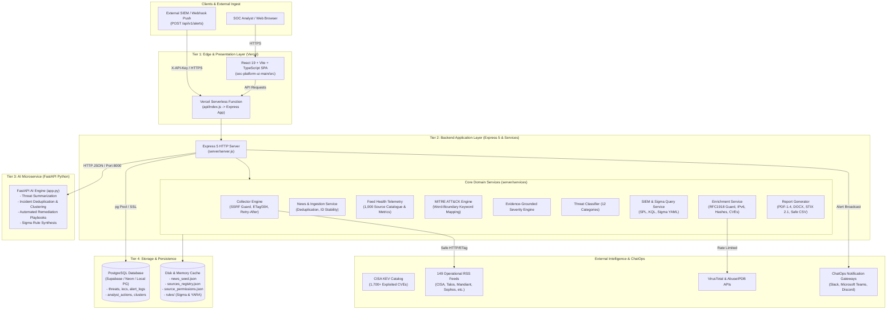
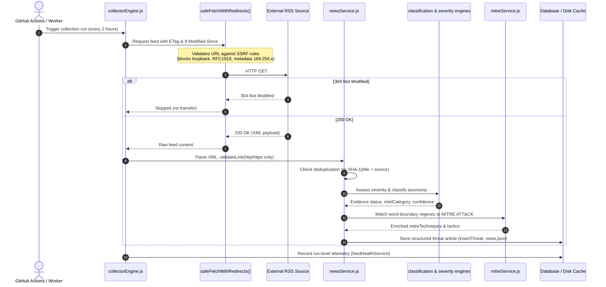

# NO ENTRY: SOC-AI — Platform Architecture & System Blueprint

**NO ENTRY** is an end-to-end, multi-tier Threat Intelligence & Detection Engineering Platform designed for modern Security Operations Centers (SOC). It ingests, normalizes, scores, enriches, and correlates global cybersecurity intelligence across 1,000+ threat sources, mapping signals to MITRE ATT&CK techniques, generating detection rules (Sigma, YARA, Splunk SPL, Azure KQL), and integrating automated AI-assisted remediation.

---

## 1. High-Level Architecture Topology



---

## 2. Directory Layout & Key Modules

```
SOC-AI/
├── api/
│   └── index.js                      # Root Vercel serverless entrypoint (re-exports UI handler)
├── app.py                            # FastAPI Python AI microservice (summarization, deduplication, Sigma)
├── CHANGELOG-FIXES.md                # Comprehensive audit log of all P0-P2 security and functional fixes
├── DEPLOYMENT.md                     # Deployment guide for Vercel, Render, and Supabase
├── docs/
│   └── PROJECT_BLUEPRINT.md          # Architectural and operational blueprint
├── render.yaml                       # Multi-service Render blueprint (Node backend + Python FastAPI)
├── requirements.txt                  # Python dependencies (FastAPI, Uvicorn, Pydantic)
├── vercel.json                       # Canonical Vercel project configuration (headers, rewrites, maxDuration)
├── .github/
│   └── workflows/
│       ├── azure-app-service.yml     # Azure Web App deployment pipeline with secret validation
│       ├── ci.yml                    # Automated CI pipeline (lint, npm audit, node tests, flake8, FastAPI startup)
│       └── scheduled-collector.yml   # 2-hour cron workflow for standalone threat intelligence collection
│
└── soc-platform-ui-main/             # Core Platform Application (Frontend + Express Server)
    ├── api/
    │   └── index.js                  # Vercel serverless adapter delegating to Express app
    ├── vercel.json                   # Synchronized Vercel configuration for UI sub-directory deployments
    ├── package.json                  # Scripts: build, test, lint, server, collector
    │
    ├── src/                          # React 19 Frontend (TypeScript + Vite)
    │   ├── App.tsx                   # Main route switch and platform layout shell
    │   ├── pages/
    │   │   ├── Dashboard.tsx         # Central SOC Mission Control snapshot & telemetry widgets
    │   │   ├── IntelligenceWorkspace.tsx # Live global intelligence news feed & analysis
    │   │   ├── Threats.tsx           # Active threat ledger, severity breakdown, and exports
    │   │   ├── MitreHeatmap.tsx      # Interactive 14-tactic ATT&CK matrix visualization
    │   │   ├── RuleLibrary.tsx       # Sigma & YARA rule browser with live search and downloads
    │   │   ├── Enrichment.tsx        # IOC inspection (IP, Hash, Domain, CVE) and SIEM query builder
    │   │   ├── Sources.tsx           # 1,000-source catalogue, lifecycle status, and health metrics
    │   │   ├── Explore.tsx           # Timezone-aware date-bounded threat archive query tool
    │   │   ├── AIBrief.tsx           # Extractive intelligence digest and AI executive briefing
    │   │   └── Settings.tsx          # System integrations, API keys, and notification channels
    │   └── components/
    │       ├── dashboard/            # TelemetryCards, SeverityChart, MitreMiniMatrix, CveTracker
    │       └── layout/               # Sidebar, TopBar, CollectionStatusBar
    │
    ├── server/                       # Backend Application Server (Node.js Express 5)
    │   ├── server.js                 # Express application initialization, middleware, routes mounting
    │   ├── collector.js              # Standalone CLI and cron runner with process-lock overlap protection
    │   ├── routes/
    │   │   ├── dashboard.js          # /api/dashboard/snapshot (unified telemetry payload)
    │   │   ├── news.js               # /api/news (paginated, sorted, filtered intelligence feed)
    │   │   ├── threats.js            # /api/threats (active threats, simulated demo records)
    │   │   ├── mitre.js              # /api/mitre (matrix counts, technique details, tactic breakdown)
    │   │   ├── enrich.js             # /api/enrich (IP, hash, CVE, SIEM query generation)
    │   │   ├── rules.js              # /api/rules (Sigma and YARA rule retrieval)
    │   │   ├── sources.js            # /api/sources (catalogue metadata, health telemetry, permissions)
    │   │   ├── explore.js            # /api/explore (date range queries and archive coverage)
    │   │   ├── analyst.js            # /api/analyst (workflow status changes, notes, audit trails)
    │   │   ├── ai.js                 # /api/ai (proxy to FastAPI microservice, status telemetry)
    │   │   ├── webhooks.js           # /api/webhooks, /api/notifications (ChatOps dispatchers)
    │   │   └── reports.js            # /api/reports, /api/threats/export (PDF, DOCX, STIX, CSV)
    │   │
    │   ├── services/                 # Shared Business Logic & Engines
    │   │   ├── collectorEngine.js    # Bounded fetch pool, safeFetchWithRedirects, SSRF boundary
    │   │   ├── newsService.js        # RSS parsing, link validation, dedupeKey, ID derivation
    │   │   ├── feedHealthService.js  # Source health tracking, lifecycle taxonomy, target reconciliation
    │   │   ├── mitreService.js       # 52 technique keywords, word-boundary regexes, hit counting
    │   │   ├── enrichmentService.js  # Private IP detection, IPv6 parsing, VirusTotal & AbuseIPDB
    │   │   ├── siemQueryService.js   # IOC escaping, Splunk SPL, Azure KQL, Sigma YAML syntax
    │   │   ├── severityEngine.js     # Evidence-grounded severity classification (Critical to Low)
    │   │   ├── classificationEngine.js # 12-category threat taxonomy (Ransomware, APT, Exploit, etc.)
    │   │   ├── permissionService.js  # Source syndication terms, attribution rules, content restrictions
    │   │   ├── collectionRunService.js# Run-level telemetry, start/complete metrics, history persistence
    │   │   ├── reportGenerator.js    # PDF-1.4 binary engine, Word DOCX, STIX 2.1, formula-safe CSV
    │   │   ├── kevSnapshot.js        # CISA Known Exploited Vulnerabilities catalog loader
    │   │   ├── dashboardEvidence.js  # Date-filtered metrics and extractive intelligence digest
    │   │   └── emailService.js       # SMTP alert notification dispatcher
    │   │
    │   ├── db/
    │   │   └── db.js                 # PostgreSQL connection pool with graceful offline fallback
    │   └── data/
    │       ├── sources_registry.json # Canonical registry of 1,055 curated threat intelligence sources
    │       ├── source_permissions.json# License, scraping terms, and attribution policy matrix
    │       ├── news_seed.json        # Lightweight seed data for demo mode and offline test execution
    │       └── rules/                # Sigma (sigma_rules.yml) and YARA (yara_rules.yar) rule files
    │
    └── tests/                        # Automated Node.js Test Suites (152 Tests)
        ├── security_fixes.test.js    # Timing-safe auth, fail-closed endpoints, CSV injection, MITRE regex
        ├── feed_reliability.test.js  # SSRF protection, URL normalization, lifecycle accounting, news archive
        ├── platform_verification.test.js # Core platform verification, report generation, analyst actions
        ├── dashboard_evidence.test.js# Dashboard range filters, severity counts, digest generation
        └── vercel_dashboard.test.js  # Vercel serverless parity tests
```

---

## 3. Data Pipeline & Processing Flow



---

## 4. Key Engines & Domain Services

| Service / Engine | File Path | Core Responsibility |
|---|---|---|
| **Collector Engine** | `collectorEngine.js` | Concurrency pool (`limit=5`), per-source timeout isolation, manual redirect hop inspection to prevent SSRF redirect attacks, conditional HTTP caching (`ETag`, `Last-Modified`). |
| **News Service** | `newsService.js` | RSS parsing, protocol sanitation (`validateLink`), collision-resistant dedupe hashing, deterministic ID derivation (`art-[sha1:16]`), and safe date sorting. |
| **MITRE Engine** | `mitreService.js` | 14 Enterprise ATT&CK tactics, 52 technique keyword mappings with strict `\b...\b` word-boundary matching to prevent substring false positives (e.g. "resource" -> `rce`). |
| **Enrichment Engine** | `enrichmentService.js` | IP reputation, RFC1918/loopback/link-local boundary checks, IPv6 support, VirusTotal and AbuseIPDB rate limiting, hash validation (32, 40, 64 hex), and shared regex IOC extraction. |
| **SIEM Query Generator** | `siemQueryService.js` | Automatically constructs threat hunting queries for Splunk (`SPL`), Azure Sentinel (`KQL`), and Sigma (`YAML`), with character escaping and syntax validation. |
| **Report Generator** | `reportGenerator.js` | Generates standard PDF-1.4 documents from scratch, Microsoft Word DOCX archives, STIX 2.1 bundles, and CSV exports with formula injection defense (`'` prefixing). |
| **Analyst Service** | `analyst.js` | Manages SOC analyst triage workflows (`under_review`, `action_required`, `resolved`, `dismissed`), note appending, audit trails, and database persistence. |
| **Permission Engine** | `permissionService.js` | Enforces licensing rules, attribution notices, summary character caps, and image hotlink suppression across all ingested news sources. |
| **AI Microservice** | `app.py` | FastAPI Python service providing extractive/abstractive summarization, Jaccard/TF-IDF incident deduplication clustering, and Sigma rule synthesis. |

---

## 5. Security & Threat Modeling

1. **Authentication & Fail-Closed Gateways**:
   - Ingestion (`/api/v1/alerts`), notifications (`/api/notifications/send`), and analyst actions (`/api/analyst/action`) require an `INGEST_API_KEY` or `NOTIFICATION_API_KEY`.
   - Keys are evaluated in constant time using `crypto.timingSafeEqual` in Node and `secrets.compare_digest` in Python.
   - If keys are unset in the environment, endpoints fail closed with HTTP `503 Service Unavailable`.
2. **SSRF Hardening**:
   - `urlUtils.js` inspects all target URLs and redirect `Location` headers before connection.
   - Explicitly blocks: IPv4 loopback (`127.0.0.0/8`), private subnets (`10.0.0.0/8`, `172.16.0.0/12`, `192.168.0.0/16`), link-local/cloud metadata (`169.254.169.254`), decimal integer encoded IPs (e.g. `2130706433`), and IPv6 ULA/loopback (`fe80::`, `fc::/7`, `::1`).
3. **CORS Defense**:
   - Strict origin allowlist loaded from `ALLOWED_ORIGIN`.
   - Wildcards combined with credentials have been eliminated across all handlers and `vercel.json`.
4. **Rate Limiting**:
   - Sensitive endpoints and third-party enrichment APIs (`/api/enrich/*`) are rate-limited (e.g., 4 requests/min per IP to respect VirusTotal free tiers).
   - Express sets `trust proxy = 1` for accurate client IP resolution behind reverse proxies.
5. **CSV Formula Injection Prevention**:
   - Any cell value starting with `=`, `+`, `-`, `@`, `\t`, or `\r` is escaped with a leading single quote before quoting.

---

## 6. Deployment & Environment Topology

### Vercel Serverless (Frontend & Edge Handler)
- Deploys static Vite assets from `soc-platform-ui-main/dist`.
- Serverless API route: `api/index.js` routes all `/api/*` traffic into Express.
- Explicit function configuration: `maxDuration: 15s`, `memory: 1024MB`.

### Render / Railway (Background Worker & AI Microservice)
Configured declaratively in `render.yaml`:
1. **`no-entry-soc-backend`** (Node.js): Runs persistent HTTP server and continuous monitoring.
2. **`no-entry-ai-microservice`** (Python 3.11): Runs FastAPI on port 8000 via Uvicorn.

### GitHub Actions CI/CD
- **`ci.yml`**: Triggers on push/PR to `main`. Runs `npm ci`, ESLint, `npm audit --audit-level=high`, 152 Node tests, `flake8` Python linting, and FastAPI startup initialization.
- **`scheduled-collector.yml`**: Cron execution every 2 hours (`15 */2 * * *`). Runs standalone collector CLI with PID lockfile overlap prevention.
